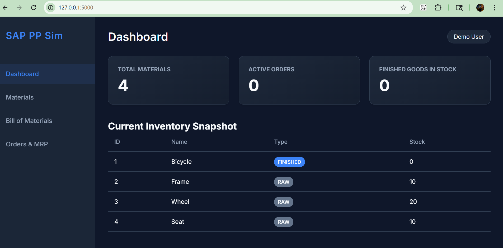
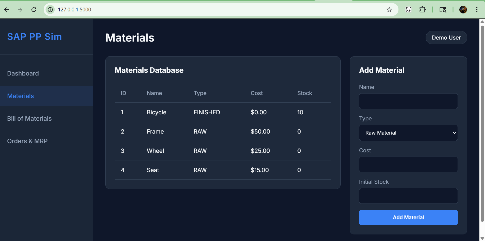
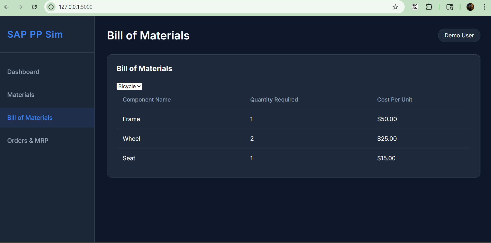
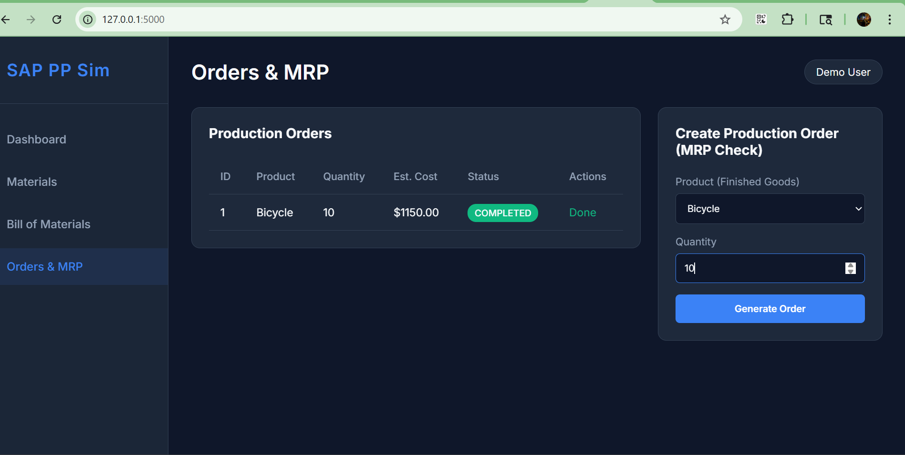

## 🎥 Project Preview



# AI-Assisted Plan-to-Produce System (SAP PP Simulation)

This project is a standalone, full-stack web application designed for college demonstration. It simulates the SAP Production Planning (PP) module's **Manufacturing Order Cycle (Plan-to-Produce)**.

## Project Structure

```
sap_pp_app/
│
├── backend/
│   ├── app.py           # Main Flask API and Server
│   ├── models.py        # SQLite Database setup and sample data seeder
│
├── frontend/
│   ├── index.html       # Clean Dashboard UI
│   ├── style.css        # Modern Dark-Mode CSS
│   └── script.js        # Vanilla JS API Calls & DOM Manipulation
│
└── README.md
```

## Features Demonstrated

1. **Materials Management (`MM`)**: Define raw materials and finished goods with cost and stock tracking.
2. **Bill of Materials (`BOM`)**: Recipes linking components to finished goods.
3. **MRP Simulation (Material Requirements Planning)**: Checks inventory shortages before creation of an order.
4. **Production Orders (`PP`)**: Create an order for finished goods.
5. **Shop Floor Execution**: Start production (`Goods Issue` - deducts components) and Complete production (`Goods Receipt` - adds finished items).

## How to Run Locally

Prerequisites: Python 3.7+ installed.

1. Open your terminal in the `backend` folder.
2. Install the required dependency:
   ```bash
   pip install flask
   ```
3. Run the application:
   ```bash
   python app.py
   ```
   *(Running this for the first time will automatically create an SQLite Database (`sap_pp.db`) and inject sample data like materials and a BOM for a 'Bicycle')*
4. Open your web browser and navigate to:
   **http://localhost:5000**

## Project Walkthrough / Test Flow
1. Go to the **Materials** tab to view your raw components (Frame, Wheels, Seat) and Finished Goods (Bicycle). Notice how much stock you currently have.
2. Go to **Orders & MRP** tab and try to simulate an order of 10 Bicycles.
3. If you lack the required materials, the MRP engine handles the constraint and kicks back a shortage message!
4. If you have sufficient stock (try ordering 1 Bicycle), the order enters `CREATED` state.
5. Click **Start Production**. This simulates *Goods Issue (Movement 261)* and instantly deducts the structural components from inventory. The order goes to `IN_PROGRESS`.
6. Click **Complete**. This simulates *Goods Receipt (Movement 101)*. The Finished stock increases, and the order is marked `COMPLETED`. Next time you look at the Dashboard overview, your totals will be perfectly updated.

---

### Screenshot References for Documentation

- **`dashboard_overview.png`**: Represents the initial landing screen showing system totals alongside a dynamic snapshot table of available current inventory.
- **`mrp_shortage_alert.png`**: Demonstrates the frontend logic where an attempt to produce too many bicycles fails because the backend MRP check evaluates `Available Stock < Required BOM amount`.
- **`production_execution.png`**: Shows an order successfully started. Visualizes the button states transitioning from "Start Production" to "Complete" alongside color-coded badges for status tracking.


---

## 📸 Project Screenshots

### 🟢 Dashboard


### 🟢 Materials Management


### 🟢 Bill of Materials (BOM)


### 🟢 Final Production Output

